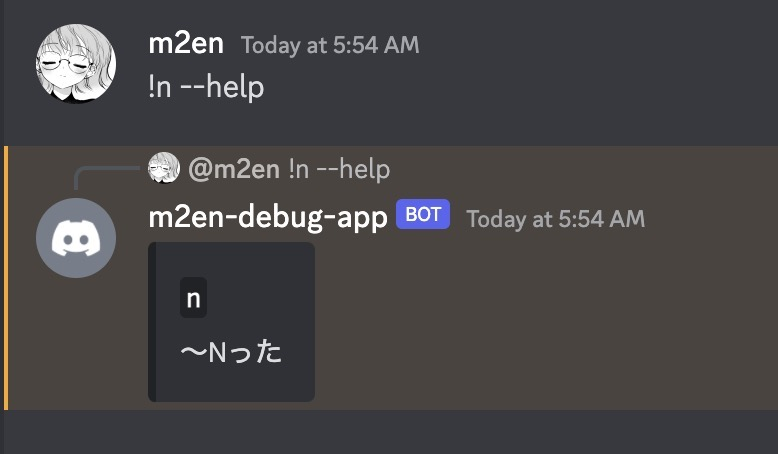

# 新しいミームを追加する

このページでは新しいミームを追加する方法について説明します。

---

## ミームが追加される流れ

1. ミームの処理を書く
2. ミームを登録する
3. ミームのテストケースを追加する

## ミーム追加の判断基準

はらちょは基本的にくだらない機能は大歓迎としています。(それは面白いからです。)

ミームも一緒で、基本的に面白ければ何でもいいです。ただ何でも OK にしていると溢れてしまうため追加前に `#無法地帯` で話をちょろっと出すのもいいかもしれません。

## ミームを追加する

### ミームの処理を書く

ミームの処理は `src/service/command/meme` 配下に書いてきます。

```ts title="src/service/command/meme/n.ts"
import type { MemeTemplate } from '../../../model/meme-template.js';

export const n: MemeTemplate<never, never> = {
  commandNames: ['n'],
  description: '〜Nった',
  flagsKeys: [],
  optionsKeys: [],
  errorMessage: 'このままだと <@521958252280545280> みたいに留年しちゃう....',
  generate(args) {
    return `${args.body}Nった`;
  },
};
```

ミームは `MemeTemplate` という型で定義されています。

この型の中身に従って書いていきます。

#### `MemeTemplate.commandNames`

ミームに使用されるコマンドを配列で指定します。必須になります。

- `['hoge']` - `!hoge` というコマンドで実行できます。
- `['hoge', 'fuga']` - `!hoge` と `!fuga` というコマンドで実行できます。

:::caution

他のミームとは重複しないようにしてください。

:::

#### `MemeTemplate.description`

ミームコマンドに対し `--help` フラグを使うと表示されるヘルプの説明欄を指定します。

わかりやすくすることをオススメします。

```ts title="src/service/command/meme/n.ts"
export const n: MemeTemplate<never, never> = {
  commandNames: ['n'],
  description: '〜Nった',
  // ...
};
```



:::tip

引数で変わるところを `〜` で表現するとわかりやすいです。

:::
