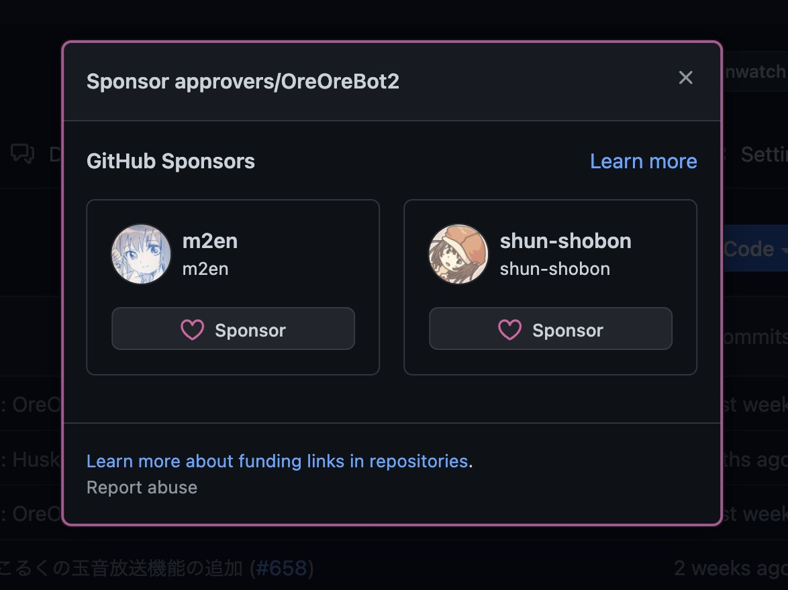

# Q&A

## はらちょからのレスポンスがありません。

[Discord Status](https://discordstatus.com/) で Discord のサービス状況を確認してください。

API Response Time が高い値を維持している場合は Discord サーバー環境が悪いということです。特に Discord には異常が見られない場合は、はらちょのサーバー環境が悪い可能性があります。

めるにメンションを行ってください。

## はらちょを自分のサーバーに招待したいです。

はらちょは限界開発鯖専用の Bot なので招待リンクは用意していません。

[開発ガイド](docs/dev_docs/local) を参考にすることで自分でホストすることは可能です。あくまで限界開発鯖専用の Bot であることをご理解ください。

## はらちょのソースコードを見たいです。

[approvers/OreOreBot2 - GitHub](https://github.com/approvers/OreOreBot2)

## 旧はらちょのソースコードを見たいです。

[approvers/OreOreBot - GitHub](https://github.com/approvers/OreOreBot)

## はらちょが反応しません

以下のチャンネルでははらちょは反応しません。

- `#独り言地帯`
- 各 times
- `#政治`
- `政治等カテゴリー` 配下の全チャンネル

## 寄付したい

[GitHub Sponsor](https://github.com/sponsors) が一応利用可能ですが、別に寄付しなくてもいいですよ (本当です。)

ただ一ヶ月 1000 円はサーバー代で飛んでいるので、はらちょが大好きな人は寄付してくれると嬉しいです。

- める
- しゅん (はらちょからのみ)
- すばる (ドキュメントからのみ)
